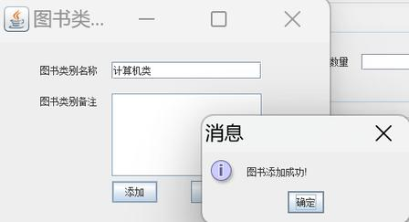
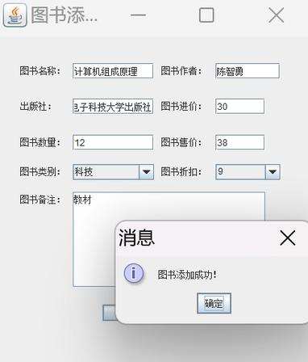
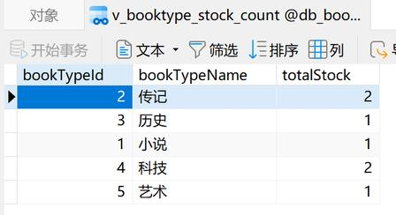
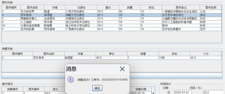

# BookManager 书店图书进货销售管理系统
## 项目简介
本项目为**数据库与信息管理课程设计**，基于 Java Swing + MySQL 开发桌面端书店图书进销存管理系统。
系统运用**触发器、存储过程、视图、外键约束、索引**实现库存自动更新与数据完整性校验，覆盖图书、图书类别、出版社、仓库、销售全流程数字化管理，替代传统纸质手工记账，提升小型书店运营效率。

> 开发作者：杨欣淼
> 专业：网络工程
> 课程：数据库与信息管理课程设计

## 技术栈
### 开发技术
- 编程语言：Java Swing（桌面GUI）
- 数据库：MySQL 8.0
- 数据库核心技术：JDBC、触发器、存储过程、视图、外键约束、索引
- 开发工具：IntelliJ IDEA、VS Code、Navicat

### 运行环境
- 硬件：AMD Ryzen7 6800H，16GB 内存
- 操作系统：Windows
- 依赖环境：JDK 1.8+、本地 MySQL 服务

## 系统功能模块
1. **管理员登录模块**
账号密码身份校验，权限隔离，仅管理员可操作系统全部业务数据。

2. **图书管理模块**
- 图书信息新增、修改、删除、条件查询
- 维护图书名称、作者、出版社、进价、售价、折扣、库存、备注
- 绑定对应图书分类ID，实时同步库存数据

3. **图书类别管理模块**
- 分类信息新增、修改、删除
- 校验规则：类别下存在关联图书时禁止删除，避免脏数据

4. **出版社管理模块**
统一维护出版社名称、地址、联系电话等基础信息。

5. **仓库管理模块**
- 仓库基础信息增删改查（仓库名称、位置、容量）
- 自动统计仓库当前库存总量

6. **销售管理（核心业务模块）**
- 支持**一单多本图书**销售，采用销售主单 + 销售明细表双表存储
- 自动计算单品利润、订单总金额、订单总利润
- 销售出库后触发器自动扣减图书库存

7. **数据统计查询模块**
- 存储过程 `GetBookTradeInfo`：自定义起止时间，查询周期内进货、销售记录
- 视图 `v_booktype_stock_count`：一键汇总所有图书分类库存总数

## 数据库设计亮点
1. 7张核心数据表
`t_book` 图书表、`t_booktype` 图书类别表、`t_press` 出版社表、`t_warehouse` 仓库表、`t_manager` 管理员表、`t_sale_order` 销售单表、`t_trade` 销售明细表

2. 触发器
图书入库、销售出库后自动更新图书库存与仓库总库存，无需业务代码手动计算。

3. 存储过程
`GetBookTradeInfo`：传入开始、结束日期，批量查询指定时间段进销货数据。

4. 视图
`v_booktype_stock_count`：封装多表联查逻辑，快速查看各分类库存总量。

5. 外键约束
图书与分类、销售明细与图书建立关联约束，杜绝孤立无效数据。

6. 索引优化
图书名称、分类ID、销售日期等高频率查询字段建立索引，提升查询性能。

## 项目目录结构
BookManager/
├── src/
│ ├── dao/ # 数据访问层，封装数据库增删改查操作
│ ├── entity/ # 实体类：图书、出版社、仓库、销售单等实体模型
│ ├── util/ # 工具类，DbUtil 数据库连接工具
│ ├── frame/ # Swing 窗体界面，所有操作弹窗页面
│ └── Main.java # 程序入口启动类
├── sql/
│ └── db_book.sql # MySQL 初始化脚本：建表、触发器、存储过程、视图
├── docs/
│ └── 课程设计报告.doc # 完整课程设计文档
└── README.md # 项目说明文档


## 运行部署步骤
### 1. 数据库初始化
1. 本地 MySQL 创建数据库 `db_book`
2. 执行 `sql/db_book.sql` 脚本，自动生成数据表、触发器、存储过程、视图
3. 修改数据库连接配置 `DbUtil.java`
```java
// 数据库连接配置示例
String url = "jdbc:mysql://127.0.0.1:3306/db_book?useUnicode=true&characterEncoding=utf8";
String user = "root";
String password = "你的本地MySQL密码";
```
### 2. Java 项目启动
1. IDEA / VS Code 导入项目，配置 JDK 1.8
2. 导入 MySQL JDBC 驱动依赖包
3. 运行 `Main.java` 启动程序，输入管理员账号密码登录系统

## 界面演示截图
> 
- 
- 
- 
- 

## 开发问题与解决方案
1. **JDBC Connection 类找不到符号**
解决方案：文件头部导入 `import java.sql.Connection;`

2. **实体类无对应参数构造器报错**
解决方案：在 Press、Warehouse 实体类新增 String 参数构造方法，匹配界面调用逻辑。

3. **数据库连接未释放，造成连接泄漏**
解决方案：DAO 层所有数据库操作在 `finally` 代码块关闭连接、Statement、ResultSet。

4. **异常未捕获导致程序闪退**
解决方案：所有数据库操作增加 `try-catch` 异常捕获，使用弹窗提示用户错误信息。

5. **删除图书类别时存在关联图书，数据冲突**
解决方案：删除前先查询该类别绑定图书数量，存在图书则拦截删除操作。

## 课程设计总结
本项目完整实践数据库标准开发流程：需求分析 → E-R 概念设计 → 逻辑表结构设计 → 物理层优化（索引 / 触发器 / 存储过程 / 视图），结合 Java Swing 实现桌面端业务管理系统。

系统完整覆盖小型书店进销存核心业务，利用数据库高级特性简化业务代码，自动维护库存数据一致性，可作为数据库课程设计、Java Swing 桌面开发学习参考项目。

## 版权说明
- 本项目为个人课程设计作业，仅用于学习交流，禁止商用；
- 项目引用第三方 JDBC 开源库，均遵守对应开源协议；
- 系统内置管理员登录权限，保护书店成本、利润等敏感经营数据；
- 可自由二次拓展，支持新增会员管理、Excel 导出、数据备份等功能。

## 联系方式
- GitHub：mia1717
- 邮箱：2692425458@qq.com

